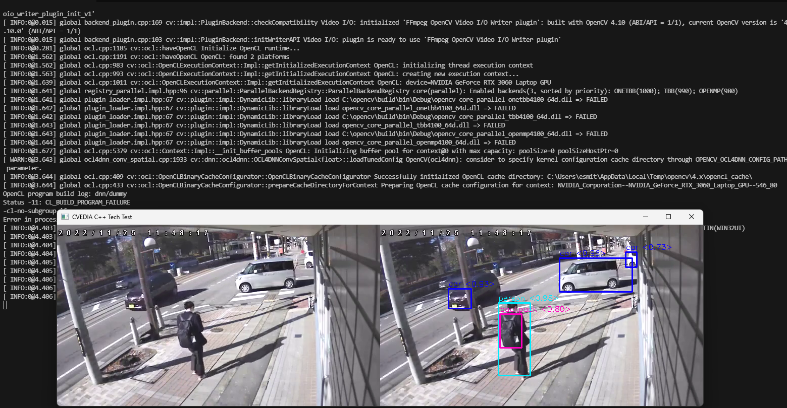

# Object Detection with OpenCV DNN

This C++ project implements an object detection application using OpenCV's Deep Neural Network (DNN) module. The application reads video frames, performs object detection using a YOLO model, and displays the results in a GUI window.

This is a console-based application, using OpenCV and [OpenCV contributition](https://github.com/opencv/opencv_contrib). 



## Prerequisites

- **OpenCV**: Ensure OpenCV is installed with contrib modules. If `find_package(OpenCV REQUIRED)` does not locate OpenCV, specify the path in the `CMakeLists.txt` file.

- **Weights YOLO**:

Ensure that the `model/` directory contains `coco_classes.txt`, `coco_colors.txt`, `yolov3.cfg`, and `yolov3.weights` at the same level as the `src/` and `include/` directories. Please, unzip the model.zip file with "extract here".

For the you have to download from [https://pjreddie.com/media/files/yolov3.weights](https://pjreddie.com/media/files/yolov3.weights). Feel free to explore the YOLO [webpage](https://pjreddie.com/darknet/yolo/)

## How to run?

```bash
	detection.exe <filename.mp4>
```


## Inference Engine Configuration

The inference engine is set with the following lines in `opencvinferenceengine.cpp`:

```cpp
m_network.setPreferableBackend(cv::dnn::DNN_BACKEND_OPENCV);
m_network.setPreferableTarget(cv::dnn::DNN_TARGET_OPENCL);
```

You can modify these settings as needed to change the backend or target for inference.

### Notes

This code has not been tested on a Linux-based machine due to the lack of availability. However, it has been successfully built using GitHub Actions with a Linux-based configuration.